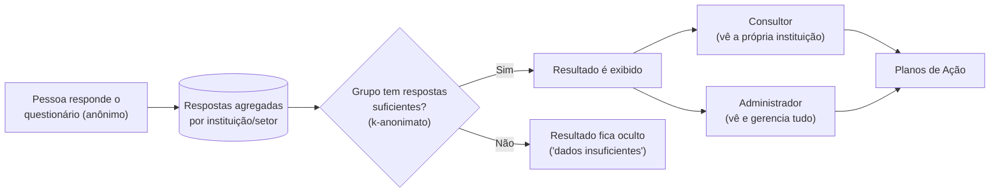

# Visão Geral

## O que é o PROTEGER-NR1 EPT

O PROTEGER-NR1 EPT ajuda instituições de ensino a identificar e prevenir
riscos psicossociais no trabalho, atendendo à NR-1 (Norma Regulamentadora
que exige das empresas e instituições a gestão de riscos psicossociais)
e apoiando a gestão escolar com dados agregados e anônimos.

Na prática, o sistema faz três coisas:

1. Aplica um questionário anônimo entre os profissionais de uma
   instituição de ensino, sobre como eles vivenciam o trabalho.
2. Transforma essas respostas em resultados agregados por instituição e
   setor — nunca por pessoa — protegidos por um mecanismo chamado
   **k-anonimato** (explicado em `05-conceitos-chave.md`).
3. Ajuda a instituição a agir sobre o que os resultados mostram, através
   de Planos de Ação e um registro de Memória Institucional.

> Espaço para print de tela: **Página institucional (`/`)**

## Quem usa o sistema

| Perfil | O que faz | Precisa de login? |
|---|---|---|
| Pessoa que responde o questionário | Responde anonimamente, sobre como vivencia o trabalho na instituição | Não |
| Consultor | Acompanha resultados e planos de ação das instituições a que está vinculado | Sim |
| Administrador | Gerencia todo o sistema — instituições, questionários, usuários, configurações | Sim |

## Panorama geral

As próximas páginas deste guia detalham cada parte: o fluxo de quem
responde (`02-fluxo-publico.md`), o que o Consultor vê
(`03-manual-consultor.md`) e o que o Administrador gerencia
(`04-manual-administrador.md`).
