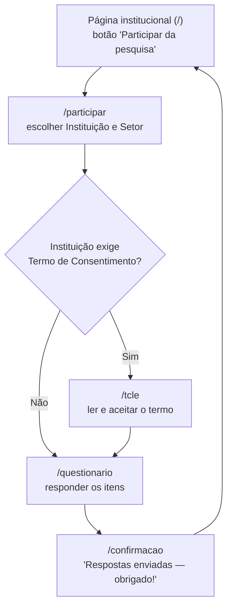

# Fluxo Público — Respondendo ao Questionário

Esta página descreve o caminho de quem responde o questionário. Não é
preciso login nem cadastro — a participação é sempre anônima, do
começo ao fim.

## Passo a passo

### 1. Página institucional (`/`)

A porta de entrada do sistema — apresenta o PROTEGER-NR1 EPT, explica
por que a avaliação de riscos psicossociais importa e como o processo
funciona. O botão **"Participar da pesquisa"** aparece duas vezes
(logo no topo e no fim da página) e leva ao passo seguinte.

> Espaço para print de tela: **Página institucional (`/`)**

### 2. Escolher instituição e setor (`/participar`)

Antes de responder, é preciso escolher a **Instituição** e o **Setor**
em duas listas — nunca digitados livremente, sempre selecionados. Um
aviso reforça que a participação é 100% anônima. O botão **"Continuar"**
só fica disponível depois de escolher os dois.

> Espaço para print de tela: **Escolha de instituição e setor (`/participar`)**

### 3. Termo de Consentimento (`/tcle`)

Quando a instituição exige um Termo de Consentimento Livre e
Esclarecido, esta tela aparece antes do questionário — é preciso marcar
"Li e concordo em participar desta pesquisa." para continuar. *Hoje
nenhuma instituição cadastrada exige esse termo, então essa tela ainda
não aparece na prática — mas o recurso já existe no sistema.*

> Espaço para print de tela: **Termo de Consentimento (`/tcle`)**

### 4. Responder o questionário (`/questionario`)

Todos os itens do questionário aparecem numa única tela, cada um com
uma escala de resposta (de discordo totalmente a concordo totalmente,
por exemplo) e uma barra mostrando quantos itens já foram respondidos.
Alguns itens só aparecem dependendo de uma resposta anterior. Ao
terminar, o botão **"Enviar respostas"** confirma o envio.

Nenhuma resposta é associada a nome, e-mail ou qualquer identificação
da pessoa — ver `05-conceitos-chave.md` para entender como isso é
garantido tecnicamente.

> Espaço para print de tela: **Questionário (`/questionario`)**

### 5. Confirmação (`/confirmacao`)

Tela final: **"Respostas enviadas — obrigado!"**, com um lembrete de
que a participação foi anônima. O botão **"Voltar ao início"** retorna
à página institucional.

> Espaço para print de tela: **Confirmação (`/confirmacao`)**
