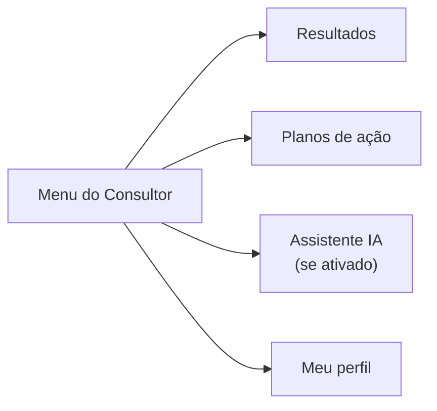

# Manual do Consultor

O Consultor acompanha os resultados e planos de ação das instituições
a que está vinculado — vínculo esse feito pelo Administrador (ver
`04-manual-administrador.md`, seção "Usuários"). O Consultor não edita
questionários nem planos de ação — seu acesso é de acompanhamento.

## Entrando no sistema

Acesse a tela de login (link "Entrar" no cabeçalho do site) com o
e-mail e senha cadastrados pelo Administrador.

> Espaço para print de tela: **Tela de login**

## Menu do Consultor

> Espaço para print de tela: **Menu lateral do Consultor**

### Resultados

Tela inicial ao entrar. Mostra, para cada instituição vinculada:

- Cartões-resumo (grupos avaliados, respostas somadas, dimensões em
  risco alto/crítico).
- Duas visualizações, em abas: **"Visão geral"** (gráfico radar por
  dimensão) e **"Mapa de risco"** (mapa de calor por setor/dimensão).
- Resultados detalhados por setor, já filtrados por k-anonimato — um
  grupo pequeno demais aparece como "dados insuficientes" em vez do
  valor real (ver `05-conceitos-chave.md`).
- A seção de Memória Institucional (registros históricos da
  instituição, cadastrados pelo Administrador).

> Espaço para print de tela: **Resultados do Consultor**

### Planos de ação

Ações planejadas para melhorar os pontos identificados nos resultados,
organizadas por ciclo. Três formas de visualizar a mesma lista, em
abas: **Kanban** (colunas por status), **Tabela** e **Calendário**
(por prazo). O Consultor visualiza planos de ação e o andamento das
tarefas, mas não cria nem edita — essa parte é do Administrador.

> Espaço para print de tela: **Planos de ação (visão Kanban)**

### Assistente IA

Só aparece no menu quando o Administrador ativa o recurso em
Configurações (ver `06-recursos-de-ia.md`). Permite conversar com um
assistente sobre o sistema e sobre os resultados das instituições
vinculadas ao Consultor — nunca de outras instituições.

> Espaço para print de tela: **Assistente IA**

### Meu perfil

Dados da própria conta e opção de trocar a senha.

> Espaço para print de tela: **Meu perfil**
