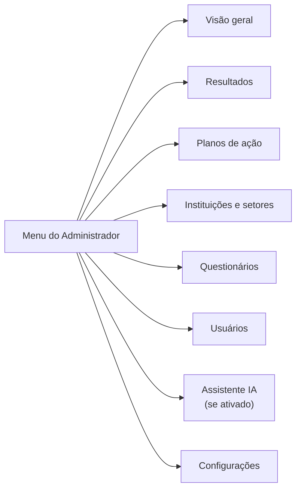

# Manual do Administrador

O Administrador tem acesso completo ao sistema: cadastra instituições e
questionários, gerencia usuários, acompanha resultados de todas as
instituições e configura os recursos opcionais.

## Entrando no sistema

Acesse a tela de login (link "Entrar" no cabeçalho do site) com o
e-mail e senha de Administrador. A primeira conta é criada no momento
da instalação do sistema.

> Espaço para print de tela: **Tela de login**

## Menu do Administrador

> Espaço para print de tela: **Menu lateral do Administrador**

### Visão geral

Painel inicial com números-resumo de todo o sistema: total de
instituições e questionários ativos, usuários por papel, respostas
recebidas (total e nos últimos 7/30 dias), um alerta de quantos grupos
ainda estão abaixo do limiar de k-anonimato, e um ranking das
instituições com mais respostas.

> Espaço para print de tela: **Visão geral**

### Resultados

Igual ao que o Consultor vê (cartões-resumo, abas "Visão geral"/"Mapa
de risco"), mas sem restrição — o Administrador filtra por qualquer
combinação de instituições, setores, questionários e instrumento
(Karasek, COPSOQ ou misto) ao mesmo tempo.

> Espaço para print de tela: **Resultados (Administrador)**

### Planos de ação

Mesmas três visualizações do Consultor (**Kanban**, **Tabela**,
**Calendário**), mas aqui o Administrador cria e edita planos, ações e
tarefas, define responsáveis e prazos, e marca dependências entre
ações (uma ação só pode avançar depois de outra terminar).

> Espaço para print de tela: **Planos de ação (Administrador)**

### Instituições e setores

Cadastro das instituições participantes e dos setores de cada uma.
Cada instituição escolhe qual questionário está usando no momento.

> Espaço para print de tela: **Instituições e setores**

### Questionários

Montagem dos questionários aplicados: domínios (agrupamentos de
perguntas) e itens (as perguntas em si), usando os instrumentos
Karasek e/ou COPSOQ (explicados em `05-conceitos-chave.md`). Também é
possível gerar um rascunho de questionário com IA (ver
`06-recursos-de-ia.md`), sempre revisado antes de salvar.

> Espaço para print de tela: **Questionários**

### Usuários

Cadastro de contas de Consultor e Administrador, e o vínculo entre
Consultores e as instituições que cada um acompanha.

> Espaço para print de tela: **Usuários**

### Assistente IA

Só aparece quando o recurso está ativado. O Administrador conversa
sobre qualquer instituição (sem restrição de vínculo) e também pode
auditar — consultar, exportar ou excluir — as conversas de qualquer
usuário, através do seletor "Ver conversas de".

> Espaço para print de tela: **Assistente IA (Administrador)**

### Configurações

Seis abas, cada uma com uma responsabilidade:

| Aba | O que configura |
|---|---|
| **k-anonimato** | O número mínimo de respostas para um resultado ser exibido |
| **Recursos de IA** | Liga/desliga os três recursos opcionais de IA (`06-recursos-de-ia.md`) |
| **Provedor LLM** | A conexão com o provedor de IA usado pelos recursos acima |
| **Exportação de dados** | Exportação em CSV/PDF de respostas, resultados, planos de ação, questionários e do painel Visão geral |
| **Log de atividade** | Histórico de ações realizadas por Administradores no sistema |
| **Resetar sistema** | Apaga todos os dados operacionais do sistema, preservando as contas de Administrador — ação irreversível, com dupla confirmação |

> Espaço para print de tela: **Configurações — aba Exportação de dados**

> Espaço para print de tela: **Configurações — aba Resetar sistema**
