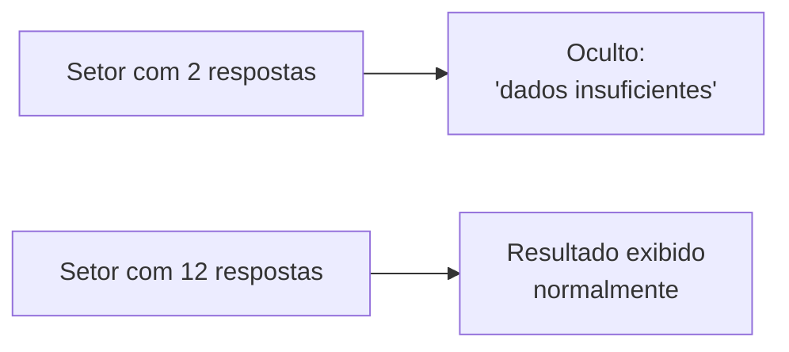

# Conceitos-Chave

Esta página explica, sem jargão técnico, os termos que aparecem nas
telas de Resultados e Questionários.

## k-anonimato — por que alguns resultados ficam ocultos

Mesmo sem coletar nome ou e-mail, é possível "adivinhar" quem respondeu
o quê se o grupo for pequeno demais — por exemplo, um setor com só duas
pessoas. Para evitar isso, o sistema só mostra um resultado quando o
grupo (instituição + setor + questionário) tem respostas suficientes.
O número mínimo é configurável pelo Administrador (Configurações →
aba k-anonimato) — o padrão é 5.

Isso vale tanto para o Consultor quanto para o Administrador — ninguém
vê o resultado de um grupo pequeno demais, mesmo tendo acesso total ao
sistema.

## Karasek Demand-Control

Um dos dois instrumentos (métodos de avaliação) que o sistema sabe
calcular. Cruza duas medidas — quanta **demanda psicológica** (pressão,
ritmo, exigência) a pessoa sente no trabalho, e quanto **controle**
(autonomia, poder de decisão) ela tem sobre como fazer esse trabalho —
e classifica o grupo num de quatro quadrantes:

| | Controle baixo | Controle alto |
|---|---|---|
| **Demanda alta** | Alto desgaste (maior risco) | Trabalho ativo |
| **Demanda baixa** | Trabalho passivo | Baixo desgaste (menor risco) |

## COPSOQ

O outro instrumento suportado. Diferente do Karasek, o COPSOQ avalia
vários domínios (temas) separadamente — por exemplo, exigências no
trabalho, organização do trabalho, relações sociais. Cada domínio recebe
uma nota de 0 a 100, classificada numa de três faixas:

- **Verde** — favorável, baixo risco.
- **Amarelo** — intermediário, atenção.
- **Vermelho** — desfavorável, alto risco.

Um questionário pode combinar domínios dos dois instrumentos ao mesmo
tempo (questionário "misto") — quem responde não percebe essa diferença,
vê só uma lista de perguntas.

## Planos de Ação

Depois de identificar pontos de atenção nos resultados, o Administrador
pode registrar ações concretas para melhorá-los — cada uma com título,
responsável, prazo, uma lista de tarefas (checklist) e, se fizer
sentido, dependência de outra ação já em andamento. As ações são
organizadas por ciclo (por exemplo, um ciclo por semestre ou ano) e
podem ser vistas em Kanban, Tabela ou Calendário.

## Memória Institucional

Um registro histórico da instituição — eventos, decisões, mudanças —
que dá contexto aos resultados ao longo do tempo. Cadastrado pelo
Administrador, visível também ao Consultor da instituição.
